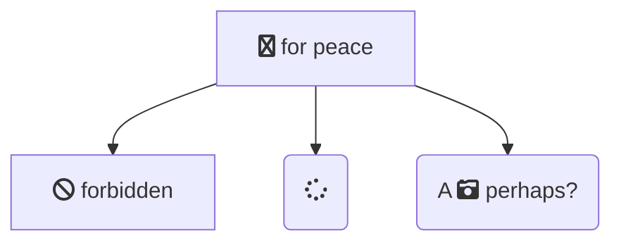

[[DS & Algo]]

$m^3$ – Markdown Mind Map

```bash
$ python --m3dir ~/Documents/

Reading Markdown files...
Getting References

Ready !!
```


```mermaid
graph TD
    B["fa:fa-twitter for peace"]
    B-->C[fa:fa-ban forbidden]
    B-->D(fa:fa-spinner);
    B-->E(A fa:fa-camera-retro perhaps?);
```

